# AI Architecture & Recommendation Engine
### AI-Powered Inclusive Tourism Ecosystem for Bagalkote

## 1. Overview

The AI architecture is engineered around the central theme of **Inclusive Growth**. Rather than merely optimizing for monument footfall, the AI systems are programmed to redistribute tourist attention and economic spending directly to local handloom weavers, rural artisans, traditional culinary providers, and verified regional guides.

```mermaid
graph LR
    subgraph TouristInput ["Tourist Query / Profile"]
        T1["Interests (Handloom, Food, Heritage)"]
        T2["Mobility (Elderly, Wheelchair)"]
        T3["Language (Kannada, Hindi, English)"]
        T4["Budget & Duration"]
    end

    subgraph AIProcessing ["AI Matching & Retrieval"]
        P1["Intent & Entity Extraction"]
        P2["Rule-based Filtering"]
        P3["BM25 Semantic Retrieval"]
        P4["Multi-Criteria Scoring Engine"]
    end

    subgraph OutputLayer ["Inclusive Recommendations"]
        O1["Verified Artisan Society (Ilkal / Guledgudd)"]
        O2["Traditional Food Provider (Jolada Rotti)"]
        O3["Accessible Heritage Trail (Pattadakal)"]
        O4["Transparent Match Reasons & Citations"]
    end

    TouristInput --> AIProcessing
    AIProcessing --> OutputLayer
```



---

## 2. Tourist–Local Skill Matching Engine (Module 12)

### 2.1 Concept: "Meet the People Behind Bagalkote"
The matching engine maps tourist interests directly to certified local masters:
$$\text{Tourist Interest} \longrightarrow \text{AI Engine} \longrightarrow \text{Local Skill} \longrightarrow \text{Local Provider} \longrightarrow \text{Authentic Experience}$$

### 2.2 Scoring Formula
The match score $S \in [0, 98]$ is calculated transparently as:
$$S = S_{\text{base}} + W_{\text{interest}} \cdot M_{\text{interest}} + W_{\text{lang}} \cdot M_{\text{lang}} + W_{\text{mobility}} \cdot M_{\text{mobility}}$$

Where:
- $S_{\text{base}} = 50$: Baseline recommendation score.
- $W_{\text{interest}} = 30$: Direct match on core interest (e.g., weaving, culinary, temple architecture).
- $W_{\text{lang}} = 10$: Native language compatibility (Kannada: +10, Hindi: +8, English: +5).
- $W_{\text{mobility}} = \pm 10$: Accessibility compatibility (ground-level workshop boost or step-penalty).

### 2.3 Transparent "Why This Matches You" Explanations
Every recommendation generates user-auditable reasons:
- `✓ Directly matches your interest in Handloom Weaving`
- `✓ Step-free or ground-level accessible workshop location`
- `✓ Native Kannada-speaking local craft guides available`
- `✓ Verified non-profit artisan cooperative`

---

## 3. Grounded Prompt Engineering for Groq LLM

### 3.1 System Prompt Template
```
You are the official AI Travel Companion for Bagalkote District, Karnataka, India.
TAGLINE: "Inclusive Tourism for Every Traveller, Opportunities for Every Local."
CORE MISSION: "AI should not only take tourists to monuments. AI should connect tourists with the people, culture, skills and businesses of Bagalkote."

STRICT GUARDRAILS & ZERO HALLUCINATION POLICY:
1. Ground your answer strictly in the provided verified documents and verified Bagalkote knowledge.
2. If verified information is not available, explicitly state: "I don't have verified information for this."
3. For emergency or safety numbers: NEVER fabricate numbers. Only cite official numbers (1077 for District Helpline, 112 for Police, Hangal Kumareshwara Hospital).
4. For accessibility: NEVER make unverified claims. Badami caves have ~200 steep steps; Pattadakal and Kudala Sangama have ramps and wheelchair facilities.
5. Emphasize inclusive growth: Highlight local artisans (Ilkal Sarees, Guledgudd Khana), local food (Jolada Rotti, Ennegayi, Kardant), and local guides where relevant.
6. At the end of your response, include a brief "Verified Sources:" line with the title and source URL.
7. Language instruction: [kn: Kannada / hi: Hindi / en: English]
```

---

## 4. Responsible AI & Safeguards

1. **Non-Scientific Score Disclosure:** The AI Match Score is explicitly declared as a recommendation heuristic rather than a scientifically validated probability.
2. **Deterministic Fallback:** If the external LLM is unreachable or returns an error, the local synthesis engine executes rule-based generation to guarantee 100% uptime.
3. **Emergency Disclaimers:** No route is ever claimed to be "100% safe." All safety notices state: *"Safety information is based on available verified sources."*
