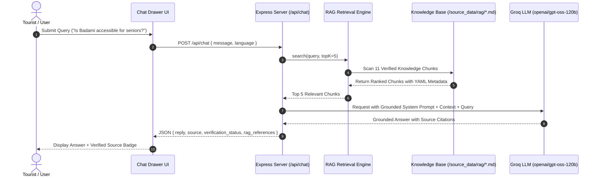

# RAG Architecture & Knowledge Retrieval Pipeline
### AI-Powered Inclusive Tourism Ecosystem for Bagalkote

## 1. Pipeline Overview

The Retrieval-Augmented Generation (RAG) system is strictly grounded in official sources: the Archaeological Survey of India (ASI), Bagalkote District Administration (`bagalkot.nic.in`), and Karnataka Tourism (`karnatakatourism.org`).



---

## 2. Knowledge Base Structure (`/source_data/rag/`)

All knowledge documents are stored as markdown files with standardized YAML frontmatter:

```yaml
---
document_id: rag_badami_caves
title: Badami Cave Temples & Rock-Cut Architecture
category: Heritage / Rock-cut Caves
location: Badami, Bagalkote District
source: Archaeological Survey of India & Bagalkote District Tourism
source_url: https://bagalkot.nic.in/en/tourism/
verification_status: SOURCE_VERIFIED
retrieved_at: 2026-09-20T00:27:27+05:30
---
```

### Knowledge Base Index (11 Verified Chunks)
1. `rag_badami.md` - Badami Cave Temples, Agastya Lake, and steep stairs warning.
2. `rag_pattadakal.md` - UNESCO World Heritage monument complex, Chalukyan architecture, wheelchair ramps.
3. `rag_aihole.md` - Cradle of Indian temple architecture, Durga temple laboratory.
4. `rag_kudala_sangama.md` - River confluence, Basaveshwara Aikya Mantapa, elevator access.
5. `rag_almatti_dam.md` - Lal Bahadur Shastri reservoir, Mughal gardens, battery buggies.
6. `rag_ilkal_sarees.md` - GI-tagged handloom, Tope Teni pallu, Kondi weaving technique.
7. `rag_guledgudd_khana.md` - Traditional blouse fabric, dobby pit looms, weaver cooperatives.
8. `rag_bagalkote_cuisine.md` - Jolada Rotti, Ennegayi, Shenga Chutney, Amingad Kardant.
9. `rag_accessibility.md` - District-wide mobility audit, stair counts, ramp availability.
10. `rag_safety_helplines.md` - Verified emergency contacts (1077, 112, Hangal Kumareshwara Hospital).
11. `rag_chalukya_utsava.md` - Annual cultural festival in Badami and Aihole.

---

## 3. Retrieval & Grounding Mechanism

1. **Tokenization:** Multilingual tokenization supporting English, Kannada (`\u0C80-\u0CFF`), and Hindi (`\u0900-\u097F`).
2. **Term-Frequency Scoring:** Matches query tokens across document body and titles, with a $15\times$ weight boost for title matches.
3. **Prompt Injection:** Retrieved snippets are injected into the prompt as `[DOCUMENT N]` blocks.
4. **Citation Output:** The API response appends the exact source name, URL, and verification status.

---

## 4. Zero-Hallucination Guardrails

- If no verified chunk matches or if the query asks about nonexistent facilities, the system explicitly returns:  
  *“I don't have verified information for this.”*
- Emergency numbers are never fabricated; any missing medical facility is labeled:  
  *“Verification required.”*
- Under no circumstances does the system extrapolate accessibility beyond documented ASI and district audit reports.
