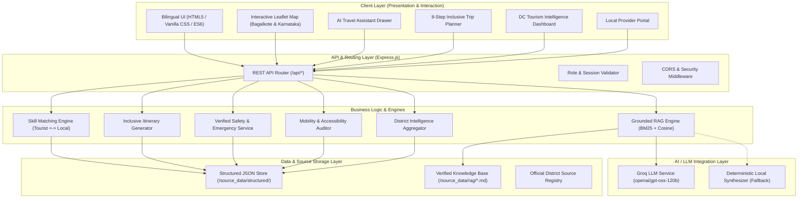

# System Architecture: AI-Powered Inclusive Tourism Ecosystem for Bagalkote

## 1. High-Level Architecture Overview

The system follows a decoupled, service-oriented architecture designed to deliver rapid response times, source-grounded answers, and high accessibility across mobile and desktop devices.

---

## 2. Component Descriptions

### 2.1 Client Layer
- **Responsive Heritage UI:** Custom CSS system utilizing Badami sandstone (`#C85A32`), Chalukyan gold (`#D4AF37`), and deep charcoal backgrounds with glassmorphism card surfaces.
- **Multilingual Support:** Instant trilingual translation engine (Kannada, English, Hindi) operating client-side for zero latency on UI elements.
- **Interactive Map:** Leaflet.js rendering OpenStreetMap tiles centered on Bagalkote (`16.1800° N, 75.6900° E`) with dynamic category filters (Heritage, Artisans, Homestays, Food, Safety).

### 2.2 Server & Service Layer (Node.js / Express)
- **RAG Engine (`RAGEngine`):** Loads verified markdown chunks from `/source_data/rag/`, parses YAML metadata, extracts search tokens, and ranks chunks using BM25-inspired term frequency and title boosts.
- **Skill Matching Service:** Computes multi-factor match scores between tourist interests, languages, and budgets against verified local artisans and cultural practitioners.
- **Trip Planner Service:** Combines verified destinations, local food providers, and handloom cooperatives into a time-budgeted, mobility-aware itinerary.
- **District Intelligence Aggregator:** Provides real-time simulated KPIs for the District Commissioner's dashboard, strictly isolated with `DEMO / PROTOTYPE DATA` banners.

### 2.3 AI Integration Layer
- **Groq API Gateway:** Uses `openai/gpt-oss-120b` via Groq's low-latency inference engine to produce natural, contextual, source-grounded answers.
- **Local Fallback Engine:** If the external Groq API key is omitted or the network is offline, a deterministic local rule synthesizer immediately answers queries without application disruption.

### 2.4 Data Storage Layer
- **Structured Knowledge Base:** 16 verified JSON datasets under `/source_data/structured/` covering destinations, heritage, culture, festivals, artisans, handicrafts, businesses, guides, homestays, food providers, local experiences, local skills, accessibility, safety, languages, and sources.
- **Provenance Registry:** Every record maintains an explicit verification state (`SOURCE_VERIFIED`, `ADMIN_VERIFIED`, or `DEMO_DATA`).
